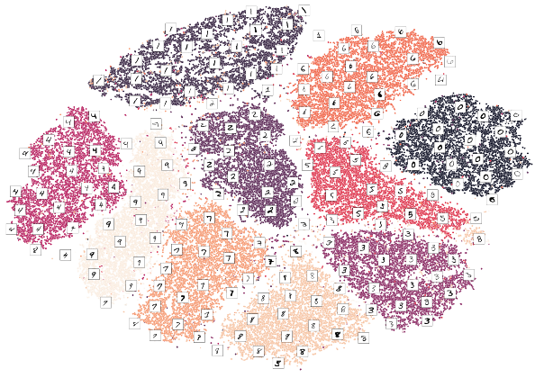

v# Machine-Learning-Zero2Hero

</img>

## 👋 Introduction 

Welcome to Machine Learning Hero-to-Zero. In this repository, you will find Jupyter notebooks that introduce machine learning algorithms by combining mathematical aspects behind the algorithms and practices. Currently, there are 20 notebooks in the following subjects:

1. Linear Regression
2. Logistic Regression
3. GLM and Robust Regression
4. Support Vector Machines
5. Naive Bayes Classifier
6. Dimensionality Reduction

I am planning to expand this repository with around 40 notebooks. Each folder within the repository contains descriptions of the notebooks it houses. For instance, the 'Linear Regression' folder provides short explanations of the content covered in those specific notebooks.

 ## 🔥 Next Content:
 
Machine Learning on Python: Clustering 

## 📼 Courses

Additionally, I would like to share two of my favorite machine-learning courses. The first one provides a comprehensive overview of the topics covered in this repository and more, with a focus on statistical learning theory. I particularly enjoyed the unique experience of listening to bird songs in the background while watching the great lectures from the University of Tubingen. The second course covers more topics such as neural networks and reinforcement learning, but it does not cover traditional machine learning approaches in as much detail as the first course.

1. [Statistical Machine Learning by Ulrike von Luxbury at the University of Tubingen](https://www.youtube.com/watch?v=jFcYpBOeCOQ&list=PL05umP7R6ij2XCvrRzLokX6EoHWaGA2cC)

2. [Stanford CS229: Machine Learning Course by Andrew NG at Stanford University](https://www.youtube.com/watch?v=jGwO_UgTS7I&list=PLoROMvodv4rMiGQp3WXShtMGgzqpfVfbU)

I suggest checking out the course web pages to determine which one would be more suitable for your needs. In addition to these courses, I highly recommend exploring Andrew Ng's [Machine Learning Specialization](https://www.coursera.org/specializations/machine-learning-introduction) and the [IBM Machine Learning Professional Certificate](https://www.coursera.org/professional-certificates/ibm-machine-learning) on Coursera for more hands-on learning.

## ❓ Possible Questions

### 1️⃣ Why am I doing that? 

Every person has a different way of learning something, the one generally works for me is to teach what I am studying. Even while taking some notes I generally take them as if I'm teaching something to someone. As a matter of fact, while learning machine learning and deep learning I also followed a similar way. Afterwards, I thought I could edit and develop my machine-learning notebooks so that other people could make use of it and perhaps expedite their learning process. These notebooks contain a lot of practices and mathematical aspects of algorithms as well as additional sources. 

### 2️⃣ Is it a good idea to combine mathematics and exercises in one notebook?

* I am never content until I have constructed a mechanical model of the subject I am studying. If I succeed in making one, I understand. Otherwise, I do not. - Lord Kelvin

Many people would probably separate the mathematical aspect from the practice which may be a good thing to do but I am one of those people who does not get satisfied until he/she constructs a mechanical model of the subject being studied. I like the idea of having the mathematical models in the same notebook so that one can return and revise easily. I hope this is also the way that works for you as well.

### 3️⃣ How are notebooks organized?

For each algorithm that I introduce, I follow three main steps.

1. I first explain the algorithms and mathematics under the hood. 
2. Afterwards, I take you through how to use the algorithm on Python. 
3. Lastly, I show more practice by using the algorithms on different datasets.

I will try to explain algorithms and code as much as possible, however, these topics may be hard for a beginner. In fact, these notebooks may not be suitable for beginners but for those who have some idea of how algorithms work and want to improve their understanding of both mathematics behind the algorithms and the codes to implement the algorithm. In each section, I added external resources that I found helpful when I was learning machine learning. Furthermore, I did not only introduce the algorithms but also introduced important preprocessing concepts.  I think notebooks should not only introduce algorithms to someone but also they should provide necessary information about cross-validation, preprocessing, and visualization because these steps are really important in machine learning. Moreover, these notebooks are sequential. Every notebook is designed to take one of the ideas further in the previous notebooks. 
 
 I think these notebooks can help a lot to those who intuitively know the algorithms to some extent but want to dive deeper and get some more experience. I hope some people can make use of these notebooks and expedite their machine-learning journey.
 

